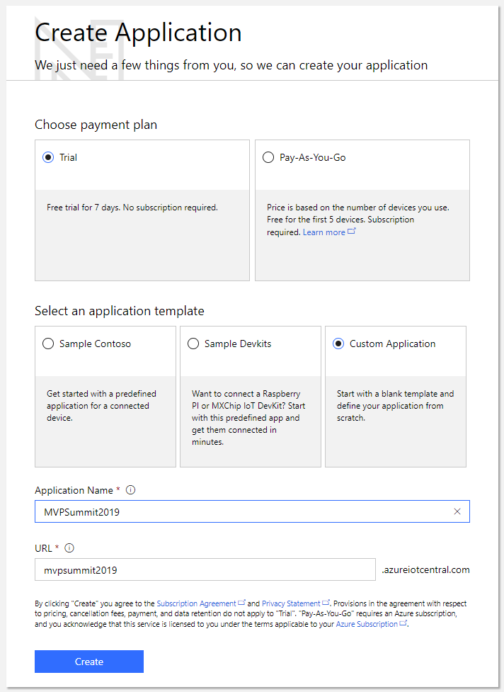

# Azure IoT Central - Fully managed hosted platform to build and run your IoT Solutions at scale

Azure IoT Central is a fully managed hosted IoT platform that makes it easy to connect, monitor, and manage your IoT assets at scale. Bring your IoT solutions to market faster while staying focused on the business problem and your customers.

* Simplify setting up your IoT solution 
* Connect and manage your things with ease
* Rest easy with world-class security and privacy

In this workshop, you will learn how to build, use and administer an IoT Central application with the help of the following tutorials:

* Tutorial 1 - Create an application
* Tutorial 2 - Create a new custom device template
* Tutorial 3 - Connect MXChip Device to IoT Central
* Tutorial 4 - Configure rules and actions for your device
* Tutorial 5 - Administer Your Application

## Scenario

Contoso company makes Connected Air Conditioners with following device profile that they need to remotely monitor and trigger alerts when something goes wrong:

* Sends telemetry such as temperature.
* Reports device state such as ON or OFF.
* Has properties such as  firmware version and serial number.
* Has settings such to configure target temperature and fan speed.


## Tutorial: Create an application

Navigate to the Azure IoT Central Application Manager page (https://aka.ms/iotcentral). You will need to sign in with a Microsoft personal or work or school account.

To start creating a new Azure IoT Central application, select **New Application**. This takes you to the **Create Application** page.

To create a new Azure IoT Central application:

1. Choose a payment plan:
   - **Trial** applications are free for 7 days before they expire. They can be converted to Pay-As-You-Go at any time before they expire.
   - **Pay-As-You-Go** applications are charged per device, with the first 5 devices free. If you are creating a **Pay-As-You-Go** application, you need to select your *Directory*, *Azure Subscription*, and *Region*.

1. Choose a friendly application name, such as Contoso IoT. Azure IoT Central generates a unique URL prefix for you. You can change this URL prefix to something more memorable.

1. Choose **Custom application** as the application template. 

1. Select **Create**.



> **Note:** For more information regarding each of these fields, please click on this link:
https://docs.microsoft.com/en-us/azure/iot-central/howto-create-application


## Tutorial: Create a new device template

As a builder, you can create and edit the device templates in your application. When you create a device template, Azure IoT Central generates a simulated device from the template. The simulated device generates telemetry that enables you to test the behavior of your application before you connect a real device.

The following steps show you how to create a new **Connected Air Conditioner** device template for devices that send temperature telemetry to your application:

1. To add a new device template to your application, you need to go to the **Device Templates** page. To do so select the **Device Templates** on the left navigation menu.

    

2. On the **Device Templates** page, select **+ New** or **+**:

3. The page shows the templates you can choose from.

    

3. Select **Custom**, enter **Connected Air Conditioner** as the name of your device template, and then select **Create**. You can also upload an image of your device that's visible to operators in the device explorer.

    

4. In the **Connected Air Conditioner** device template, make sure you're on the **Measurements** tab where you define the telemetry.

     

     > **Note:** To change the name of the device template, select the template name at the top of the page.

### Add a telemetry measurement

1. To add the temperature telemetry measurement, select **+ New Measurement**. Then choose **Telemetry** as the measurement type.

    

2. To create **Temperature** telemetry, use the information in the following table:

     | Setting              | Value         |
     | -------------------- | -----------   |
     | Display Name         | Temperature   |
     | Field Name           | temperature   |
     | Units                | F             |
     | Min                  | 60            |
     | Max                  | 110           |
     | Decimal places       | 0             |

     You can also choose a color for the telemetry display. To save the telemetry definition, select **Save**:

     

3. After a short while, the **Measurements** tab shows a chart of the temperature telemetry from your simulated connected air conditioner device. Use the controls to manage visibility, aggregation, or to edit the telemetry definition:

    

4. You can also customize the chart using the **Line**, **Stacked**, and **Edit Time Range** controls:

    

### Add an event measurement

Use events to define point-in-time data that the device sends when there's an event such as an error or a component failure. For this tutorial we will add **Fan Motor Error** as a new event measurement.

1. To add the **Fan Motor Error** event measurement, select **+ New Measurement**. Then choose **Event** as the measurement type:

    

2. To create **Fan Motor Error** event, use the information in the following table:

     | Setting              | Value             |
     | -------------------- | -----------       |
     | Display Name         | Fan Motor Error   |
     | Field Name           | fanmotorerr       |
     | Severity             | Error             |

     To save the event definition, select **Save**:

     

3. After a short while, the **Measurements** tab shows a chart of the events randomly generated from your simulated connected air conditioner device. Use the controls to manage visibility, or to edit the event definition:

    

4. To see additional details about the event, select the event on the chart:

    

### Define a state measurement

You can use state to define and visualize the state of the device or its component over a period of time. For this tutorial we will add **Fan Mode** as a new state measurement.

1. To add a **Fan Mode** state measurement, select **+ New Measurement**. Then choose **State** as the measurement type:

    

2. To configure **Fan Mode** state, use the information in the following table:

     | Setting              | Value             |
     | -------------------- | -----------       |
     | Display Name         | Fan Mode          |
     | Field Name           | fanmode           |
     | Value                | 1                 |
     | Display label        | Operating         |
     | Value                | 0                 |
     | Display label        | Stopped           |

     To save the state measurement definition, select **Save**:

     

3. After a short while, the **Measurements** tab shows a chart of the states randomly generated from your simulated connected air conditioner device. Use the controls to manage visibility, or to edit the state definition:

    


### Configure settings

You use *settings* to enable an operator to send configuration data to a device. For example, an operator could use a setting to change the device's telemetry interval from two seconds to five seconds. In this section, you add a setting to your **Connected Air Conditioner** device template that enables an operator to set the target temperature of the connected air conditioner.

1. Navigate to the **Settings** tab for your **Connected Air Conditioner** device template.

2. You can create settings of different types such as numbers or text. Select **Number** to add a number setting to your device.

3. To configure your **Set Temperature** setting, use the information in the following table:

    | Field                | Value           |
    | -------------------- | -----------     |
    | Display Name         | Set Temperature |
    | Field Name           | setTemperature  |
    | Unit of Measure      | F               |
    | Decimal Places       | 1               |
    | Minimum Value        | 20              |
    | Maximum Value        | 200             |
    | Initial Value        | 80              |
    | Description          | Set the target temperature for the air conditioner |

    Then select **Save**:

    

    > **Note:** When the device acknowledges a setting change, the status of the setting changes to **synced**.

4. You can customize the layout of the **Settings** tab by moving and resizing settings tiles:

    

### Configure properties

_Properties_ are used to define metadata that's associated with your device. There are two categories of properties:
    
  * _Application properties_ are used to record information about your device in your cloud solution. For example, you can use application properties to record a device's last service date. These properties are stored in the application and don't synchronize with the device.

  * _Device properties_ are used to enable a device to send property values to your application. These properties can only be changed by the device. For an operator, device properties are read-only. In this scenario, the firmware version and device serial number are properties reported by the device.


1. Navigate to the **Properties** tab for your **Connected Air Conditioner** device template.

1. To add **Last Service Date** _application property_ to your device template, choose **Date** and then enter the following information.

    | Field                | Value                   |
    | -------------------- | ----------------------- |
    | Display Name         | Last Service Date       |
    | Field Name           | serviceDate             |
    | Initial Value        | 1/1/2019                |
    | Description          | Last serviced           |

    

    Select **Save**.

1. To add a _Device property_ such as **Firmware Version** to your device template, choose **Device Property** and enter the following information:

    | Field                | Value                   |
    | -------------------- | ----------------------- |
    | Display Name         | Firmware version        |
    | Field Name           | firmwareVersion         |
    | Data Type            | text                    |
    | Description          | The firmware version of the air conditioner |

    

    Select **Save**.

1. To add a location _application property_ to your device template, choose **Location**. To configure your location property, use the information in the following table:

    | Field                | Value                |
    | -------------------- | -------------------- |
    | Display Name         | Installation Address |
    | Field Name           | location             |
    | Initial Value        | Seattle, WA          |
    | Description          | Installation Address |

    Leave other fields with their default values.

    

    Select **Save**.

1. You can customize the layout of the **Properties** tab by moving and resizing property tiles.


### Configure commands

You use _commands_ to enable an operator to run commands directly on the device. In this section, you add a command to your **Connected Air Conditioner** device template that enables an operator to echo a certain message on the connected air conditioner.

1. Navigate to the **Commands** tab for your **Connected Air Conditioner** device template to edit the template.

1. Select **+ New Command** to add a command to your device and begin configuring your new command.

1. To configure your new command, use the information in the following table:

    | Field                | Value           |
    | -------------------- | -----------     |
    | Display Name         | Echo Command    |
    | Field Name           | echo            |
    | Default Timeout      | 30              |
    | Display Type         | text            |
    | Description          | Device Command  |  

    You can add additional inputs to the command by selecting **+** for **Input Fields**.

    

     Select **Save**.

1. You can customize the layout of the **Commands** tab by moving and resizing the command tiles.

### Configure Device Dashboard

Now you've defined your **Connected Air Conditioner** device template, you can customize its **Dashboard** to include the measurements, settings, and properties you defined. Then you can preview the dashboard as an operator:

1. Choose the **Dashboard** tab for your **Connected Air Conditioner** device template.

1. Select **Line Chart** to add the component onto the **Dashboard**.

1. Configure the **Line Chart** component using the information in the following table:

    | Setting      | Value       |
    | ------------ | ----------- |
    | Title        | Temperature |
    | Time Range   | Past 30 minutes |
    | Measures     | Temperature (select **Visibility** next to **Temperature**) |

    

    Then select **Save**.

1. Select the **Event History** component using the information in the following table:

    | Setting      | Value       |
    | ------------ | ----------- |
    | Title        | Fan Motor Events |
    | Time Range   | Past 30 minutes |
    | Measures     | Fan Motor Error (select **Visibility** next to **Fan Motor Error**) |

    

    Then select **Save**.

1. Configure the **State History** component using the information in the following table:

    | Setting      | Value       |
    | ------------ | ----------- |
    | Title        | Fan Mode |
    | Time Range   | Past 30 minutes |
    | Measures | Fan Mode (select **Visibility** next to **Fan Mode**) |

    

    Then select **Save**.

1. To add the device settings and properties to the dashboard, choose **Settings and Properties**. Select **Add/Remove** to add the settings or properties that you'd like to see in the dashboard.

1. Configure the **Settings and Properties** component using the information in the following table:

    | Setting                 | Value         |
    | ----------------------- | ------------- |
    | Title                   | Device properties |
    | Settings and Properties | Set Temperature<br/>Firmware version |

    Settings and properties that you've previously defined on the **Settings and Properties** pages are shown in **Available Columns**.

    

    Then select **Save**.

1. You can now see simulated data for your Connected Air Conditioner on the dashboard. You can edit the tiles and layout for the dashboard:

    


## Tutorial: Connect MXChip Device to IoT Central

Now that you understand the basic concepts about a device template, we will import an existing template from the **Device Template library** and use it to connect a real MXChip device to Azure IoT Central.

### Create MXChip device template

1. Navigate to the **Device Templates** page.

2. To create a template, start by selecting **+New**.

3. Choose **MXChip** from the pre-built templates, and click **Create**.

   

> **Note:** When you create a device template, you will see the **Device Details** page for your new device template. IoT Central automatically creates a simulated device associated device template. A simulated device lets you test the behavior of your application before you connect a real device.

   **MXChip** device template has the following characteristics:

   * Telemetry which contains the measurements for the device **Humidity**, **Temperature**, **Pressure**, **Magnetometer** (measured along X, Y, Z axis), **Accelerometer** (measured along X, Y, Z axis) and **Gyroscope** (measured along X, Y, Z axis).
   * State which contains an example measurement for **Device State**.
   * Event measurement with a **Button B Pressed** event.
   * Settings showing **Voltage**, **Current**, **Fan Speed**, and an **IR** toggle.
   * Properties containing device property **die number** and **Device Location** which is a location property as well as in a **Manufactured In** cloud property.


4.	To add a new device, choose Device Explorer in the left navigation menu. The Device Explorer shows the MXChip device template and the simulated device that was automatically created when you created the device template.

5.	To start connecting a real MXChip, choose **+New**, then **Real**.

       * Enter the Device Id **<span style="color:Red">(should be lower case)</span>** or use the suggested Device Id.
       * Enter the Device Name or use the suggested name.
    
         

6. Get connection details such as **Scope ID, Device ID, and Primary SAS key** for the added device by selecting **Connect** on the device page.

    

7. Make sure to save these details, as you will temporarily get disconnected from the internet as you prepare the DevKit device.

### Prepare the DevKit device

> **Note:** If you have previously used the device and have wifi credentials stored and would like to reconfigure the device to use a different WiFi network, connection string, or telemetry measurement, press both the **A** and **B** buttons on the board simultaneously. If it doesn't work, press **reset** button and try again.

#### To prepare the DevKit device

1. Download the latest pre-built Azure IoT Central firmware for the MXChip from the **releases** (https://aka.ms/iotcentral-docs-MXChip-releases) page on GitHub.
2. Connect the DevKit device to your development machine using a USB cable. In Windows, a file explorer window opens on a drive mapped to the storage on the DevKit device. For example, the drive might be called **AZ3166 (D:)**.
3. Drag the **iotCentral.bin** file onto the drive window. When the copying is complete, the device reboots with the new firmware.

1. When the DevKit device restarts, the following screen displays:

    ```
    Connect HotSpot:
    AZ3166_??????
    go-> 192.168.0.1
    PIN CODE xxxxx
    ```

    > [!NOTE]
    > If the screen displays anything else, reset the device and press the **A**  and **B** buttons on the device at the same time to reboot the device.

1. The device is now in access point (AP) mode. You can connect to this WiFi access point from your computer or mobile device.

1. On your computer, phone, or tablet connect to the WiFi network name shown on the screen of the device. When you connect to this network, you do not have internet access. This state is expected, and you are only connected to this network for a short time while you configure the device.

1. Open your web browser and navigate to [http://192.168.0.1/start](http://192.168.0.1/start). The following web page displays:

    

    In the web page: 
    - add the name of your WiFi network 
    - your WiFi network password
    - PIN CODE shown on the device LCD 
    - the connection details **Scope Id, Device Id, and Primary key** of your device (you should have already saved this following the steps)      
    - Select all the available telemetry measurements! 

> **Note:** You can connect to MSFTGuest or your phone's Hotspot 

1. After you choose **Configure Device**, you see this page:

    

1. Press the **Reset** button on your device.


### View the telemetry

When the DevKit device restarts, the screen on the device shows:

* The number of telemetry messages sent.
* The number of failures.
* The number of desired properties received and the number of reported properties sent.

> **Note:** If the device appears to be looping during connect check if the device is *Blocked* in IoT Central, and *Unblock* the device so it can connect to the app.

Shake the device increment the number of reported properties sent. The device sends a random number as the **Die number** device property.

You can view the telemetry measurements and reported property values, and configure settings in Azure IoT Central:

1. Use **Device Explorer** to navigate to the **Measurements** page for the real MXChip device you added:

    

1. On the **Measurements** page, you can see the telemetry coming from the MXChip device:

    

1. On the **Properties** page, you can view the last die number and the device location reported by the device:

    

1. On the **Settings** page, you can update the settings on the MXChip device:

    


## Tutorial: Configure rules and actions for your device

*This article applies to operators, builders, and administrators.*

In this tutorial, you create a rule that sends an email when the temperature reported by MXChip device exceeds 90&deg; F.


### Create a rule to monitor device telemetry

1. To add a new telemetry-based rule to your application, in the left navigation menu, select **Device Templates**:

    

    You see the **MXChip** device template you created in the previous tutorial.

2. To customize your device template, select the **MXChip** template you created in the previous tutorial.

3. To add a telemetry-based rule in the **Rules** view, select **Rules**, select **+ New Rule**, and then select **Telemetry**:

    

5. To define your rule, use the information in the following table:

    | Setting                                      | Value                             |
    | -------------------------------------------- | ------------------------------    |
    | Name                                         | MChip temperature alert           |
    | Enable rule for all devices of this template | On                                |
    | Condition                                    | Temperature is greater than 90    |
    | Aggregation                                  | None                              |

    

    Then select **Save**.

### Add an action

When you define a rule, you also define an action to run when the rule conditions are met. In this tutorial, you create a rule with an action that sends an email notification.

1. To add an **Action**, first **Save** the rule and then scroll down on the **Configure Telemetry Rule** panel. Choose the **+** next to **Actions**, and then choose **Email**:

    

2. To define your action, use the information in the following table:

    | Setting   | Value                          |
    | --------- | ------------------------------ |
    | To        | Your email address             |
    | Notes     | MXChip temperature exceeded the threshold. |

    > **Note:** To receive an email notification, the email address must be a [user ID in the application](howto-administer.md), and that user must have signed in to the application at least once.

    

3. Select **Save**. Your rule is listed on the **Rules** page.

### Test the rule

Shortly after you save the rule, it becomes live. When the conditions defined in the rule are met, your application sends a message to the email address you specified in the action.

> **Note:** After your testing is complete, turn off the rule to stop receiving alerts in your inbox.


## Tutorial: Administer Your Application

Navigate to the Administration section by choosing Administration on the left navigation menu.


The Administration section enables you to:

* Manage users
* Assign roles

Now we are going to add users as **Operators** and **Builders**

1. To add a user account to an Azure IoT Central application, use the secondary navigation menu to navigate to the Users page in the Administration section


2. On the Users page, choose “Add User” to add a user.


3. When you add a user to your Azure IoT Central application, choose a role for the user from the Role drop-down.


> **Note:** To add users in bulk, enter the User IDs of all the users you'd like to add separated by semi-colons. Choose a role from the Role drop-down and choose Save.

4. After you add a user, an entry appears for that user on the Users page

> **Note:** Edit the roles assigned to users. Roles cannot be changed once assigned. To change the role assigned to a user, delete the user and add the user again with a different role.


## Next Steps
To continue to learn about Azure IoT Central, try out the following features:
* [Analyze device data](https://docs.microsoft.com/en-us/azure/iot-central/howto-create-analytics)
* [Trigger webhook action from Rules](https://docs.microsoft.com/en-us/azure/iot-central/howto-create-webhooks)
* [Continous Data Export](https://docs.microsoft.com/en-us/azure/iot-central/howto-export-data)

## Useful Resources
* [Azure IoT Central Documentation](https://docs.microsoft.com/en-us/azure/iot-central/)
* [Azure IoT Central Pricing](https://azure.microsoft.com/en-us/pricing/details/iot-central/)
* [Send product suggestions and ideas](http://aka.ms/iotcuservoice)
