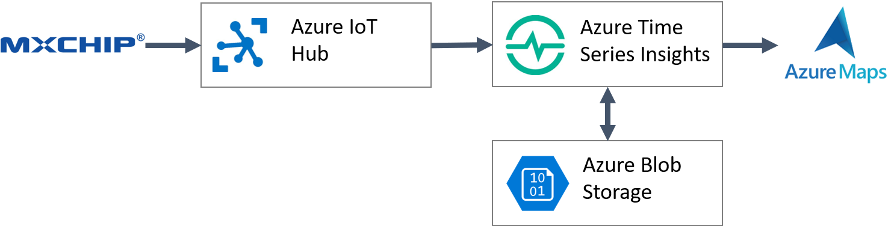
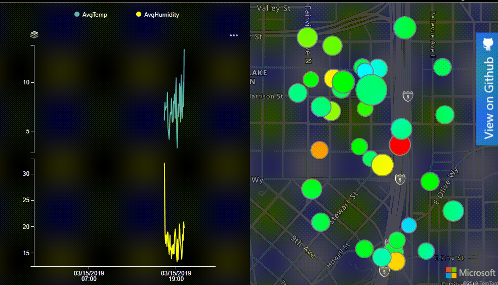

# Azure Maps

In this section of the lab you will build on the previous labs and will create a custom Time Series Insights dashboard that has a custom map visual. Since the MXChip doesn't have a location sensor, this sample will assign a random location to each timestamp. In the future, if you have a device that has location data, this sample can easily be updated to use that information instead.

## Goal of this lab

Get sensor data that is in Time Series Insights displayed in a custom web dashboard. For this to work you will need your MXChip sending data to IoT Hub, and have IoT Hub connected to Time Series Insights. The full architecture for this lab is as follows:



In this dashboard display temperature and humidity data on a chart and a map. Add some interactions between the chart and the map to create a more integated experience. Data points on the map will be scaled based on the humidity can colored based on the temperature. The final dashboard will look function like this: 



## Prerequisites

Before proceeding, you will need to do the following:

* [Create an Azure Maps account](https://docs.microsoft.com/en-us/azure/azure-maps/how-to-manage-account-keys), and [get a subscription key](https://docs.microsoft.com/en-us/azure/azure-maps/tutorial-search-location#getkey) for your account.
* [Connect your MXChip to IoT Hub](https://docs.microsoft.com/en-us/azure/iot-hub/iot-hub-arduino-iot-devkit-az3166-get-started) and sending temperature and humidity data.
* Create a Time Series Insights Preview PAYG environment and connect it to IoT Hub as documented [here](https://docs.microsoft.com/en-us/azure/time-series-insights/time-series-insights-update-create-environment#create-a-time-series-insights-preview-payg-environment). Ensure you can see your data in the [Time Series Insights portal](https://insights.timeseries.azure.com/preview).

## Lab Setup

1. Open the Windows host file located `C:\Windows\System32\drivers\etc\hosts.txt`
2. Add a new line with the following information:
> `127.0.0.1 insights-local.timeseries.azure.com` 
3. Open VS Code.
4. Open a terminal in VS Code.
5. Navigate to a directory to clone a github project to.
6. Clone the GitHub project [TSIClient: The Azure Time Series Insights JavaScript SDK](https://github.com/Microsoft/tsiclient) by typing the following into the terminal:

> `git clone https://github.com/Microsoft/tsiclient.git`

6. Enter `cd .\tsiclent\`
7. Enter `npm install`
8. Enter `npm start`
9. Open a browser and navigate to [https://insights-local.timeseries.azure.com/withplatform/basiccharts.html](https://insights-local.timeseries.azure.com/withplatform/basiccharts.html) to ensure things are working.

## Create a Map Dashboard

1. Navigate to the `tsiclient\pages\examples\withplatform` folder of the TSIClient project and create a file called `mapssample.html`.
2. Copy and paste the following code into the `mapssample.html` file.

```
<!DOCTYPE html> 
<html>
        <head>
        <title>Map Dashboard</title>
        
        <!-- styles are only used for styling header and auth elements, where possible -->
        <link rel="stylesheet" type="text/css" href="../styles.css" />     
        
        <!-- boilerplate headers are injected with head.js, grab them from the live example header, or include a link to head.js -->
        <script src="../boilerplate/head.js"></script>

        <!-- boilerplate auth code is injected with auth.js, check it out for auth setup -->
        <script src="../boilerplate/auth.js"></script>
    </head>
    <body style="font-family: 'Segoe UI', sans-serif;">

        <script>
            //Add JavaScript here.
        </script>
    </body>   
</html>
```

3. In the head section of the HTML, add a reference to the Azure Maps Web SDK by adding the following tags:

```
<!-- Add references to the Azure Maps Map control JavaScript and CSS files. -->
<link rel="stylesheet" href="https://atlas.microsoft.com/sdk/css/atlas.min.css?api-version=2" type="text/css" />
<script src="https://atlas.microsoft.com/sdk/js/atlas.min.js?api-version=2"></script>
```

4. In the body of the page we will add two `div` tags. One for hosting a Time Series Insights chart control and the other for hosting an Azure Maps control. Add the following to the body of the page:

```
<div id="chart1" style="position:relative;width: 50%;height:calc(100vh - 60px); margin-top: 40px;float:left;"></div>
<div id="myMap" style="position:relative;width:50%;height:calc(100vh - 60px);margin-top:40px;float:left;"></div>
```

5. In the script tag we will define some global variables and add a window onload event handler. In the onload event handler initialize the Time Series Insights authenication model. Copy and paste the following into the script tag:

```
 //Define an initial position for our device.
var initialPosition = [-122.33, 47.62];
var map, datasource, popup, dataLayer, hoverLayer;

window.onload = function() {
    initAuth('Maps Example');  //Initiate auth objects, header, and login modal

};
```

6. Next we will create a map instance. When loading the map we will set the style to `grayscale_dark` as that will align well with the dark theme of the sample. You will need to specify your Azure Maps key in the map options where it says `<Your Azure Maps Key>`. After creating the map instance we will add a `ready` event and add any post map load functionality in there later.

```
//Initialize a map instance.
map = new atlas.Map('myMap', {
    style: 'grayscale_dark',

    //Add your Azure Maps subscription key to the map SDK. Get an Azure Maps key at https://azure.com/maps
    authOptions: {
        authType: 'subscriptionKey',
        subscriptionKey: '<Your Azure Maps Key>'
    }
});

//Wait until the map resources are ready.
map.events.add('ready', function () {
    
});
```

7. In the maps `ready` event handler we will do the following:
 - Create a popup control to show details about a data point on a map when the user hovers over any data point.
 - Create a data source to store all data points.
 - Create a Bubble layer and define data-driven styles for the color and radius such that a color gradient is used based on the temperature information and the radius of each bubble is based on the humidity value. - A second layer will be defined with many of the same options, but will filter the data it shows based on the timestamp. This will allow us to render a data point for a specific timestamp differently than all other data points on the map.
 - Mouse move and out events will be added to the main data layer and used to highlight/unhighlight the data on the map and display the popup.
Copy the following code into the maps `ready` event hander.

```
popup = new atlas.Popup();

//Create a data source to add your data to.
datasource = new atlas.source.DataSource();
map.sources.add(datasource);

//Create a layer for rendering the data on the map as scaled circles.
dataLayer = new atlas.layer.BubbleLayer(datasource, null, {
    color: [
        "interpolate", 
        ["linear"], 
        ['get', 'temperature'],
        0, "royalblue",
        4, "cyan", 
        8, "lime", 
        10, "yellow", 
        12, "red"
    ],
    
    radius: [
        'interpolate',
        ['linear'],
        ['get', 'humidity'],
        0, 2,
        30, 30
    ],

    strokeColor: 'gray'
});

//Create a second layer that is nearly identical, but use it to highlight the selected timestamp.
hoverLayer = new atlas.layer.BubbleLayer(datasource, null, {
    color:  [
        "interpolate", 
        ["linear"], 
        ['get', 'temperature'],
        0, "royalblue",
        4, "cyan", 
        8, "lime", 
        10, "yellow", 
        12, "red"
    ],

    radius: [
        'interpolate',
        ['linear'],
        ['get', 'humidity'],
        0, 2,
        30, 30
    ],

    filter: ['==', 'timestamp', '']
});

map.layers.add([dataLayer, hoverLayer]);

map.events.add('mousemove', dataLayer, function(e){
    if(e && e.shapes && e.shapes.length > 0){
        highlightMap(e.shapes[0].getProperties().timestamp);                         
    }
});

map.events.add('mouseout', dataLayer, unhighlightMap);
```

8. Next we will create two functions for highlighting and unhighlighting data on the map. When a timestamp is highlighted, all shapes on the map except those with the specified timestamp will become semi transparent. Additionall a popup will appear over the shape on the map and display the timestamp, temperature and humidty information. Copy the following into the onload event handler.

```
function highlightMap(timestamp){
    //Filter the hover layer to show the selected timestamp.
    hoverLayer.setOptions({
        filter: ['==', 'timestamp', timestamp]
    });

    //Make all other data semi-transparent on the map.
    dataLayer.setOptions({
        opacity: 0.5
    });

    //Get the data point for the timestamp.
    var s = datasource.getShapes(['==', 'timestamp', timestamp]);
    if(s && s.length > 0){
        //Create the content for the popup and display it on the map.
        var prop = s[0].getProperties();

        popup.setOptions({
            content: '<div style="padding:5px;"><b>' + prop.timestamp + '</b><br/>AvgTemp: ' + prop.temperature + '<br/>AvgHumidity: ' +  prop.humidity + '<div>',
            position: s[0].getCoordinates(),
            closeButton: false
        });
        popup.open(map);
    }
}

function unhighlightMap(){
    //Clear the filter on the hover layer.
    hoverLayer.setOptions({
        filter: ['==', 'timestamp', '']
    });

    //Revert the opacity.
    dataLayer.setOptions({
        opacity: 1
    });

    //Close the popup.
    popup.close();
}
```

9. Next we will define the expressions for the Time Series Insights chart that displays the temperature and humidity information.

```
var tsiClient = new TsiClient();
                            
// create aggregate expressions, they are S1/S2 SKU query objects
var linechartTsqExpressions = [];

//Set a date range for the past 24 hours.
var endDate = new Date();
var startDate = new Date(endDate.valueOf() + 1000*60*60*24);

linechartTsqExpressions.push(new tsiClient.ux.TsqExpression(
    {timeSeriesId: [null]}, // instance json
    {AvgTemp: {
        kind: 'numeric',
        value: {tsx: '$event.[temperature]'},
        filter: null,
        aggregation: {tsx: 'avg($value)'}
    }}, // variable json
    { from: startDate, to: endDate, bucketSize: '5m' }, // search span
    '#60B9AE', // color
    'AvgTemp')); // alias

linechartTsqExpressions.push(new tsiClient.ux.TsqExpression(
    {timeSeriesId: [null]}, // instance json
    {AvgHumidity: {
        kind: 'numeric',
        value: {tsx: '$event.[humidity]'},
        filter: null,
        aggregation: {tsx: 'avg($value)'}
    }}, // variable json
    { from: startDate, to: endDate, bucketSize: '5m' }, // search span
    'yellow', // color
    'AvgHumidity')); // alias
```

10. Next data will be requested from Time Series Insights. A line chart will be created and the temperature, humidity and timestamp information render on the chart will be extracted and used to create data points on the map. 
- When querying data from Time Series Insights you will need to specify your Data Access FQDN URL. For example: `000000-000000-0000-00000.env.timeseries.azure.com`. You can find this in the overview of your Time Series Insights resource in the Azure portal. Copy this into the following code where it says `<Your Time Series Insights Data Access FQDN URL>`.
- For each timestamp, a random location that is within approximately within a third of a mile from an intial position will be generated. This location is then used to create a GeoJSON Point Feature that contains the timestamp, temperature and humidity information for the individual data point. The GeoJSON Point Features will be added to the data source using the `setShapes` function. This function overwrites any data already in the data source. Alternatively the `add` function can be used if we want to maintain any existing data in the data source.
- Using the GeoJSON Point Features we can calculate the bounding box area of the data set and set the maps view using the `setCamera` function. Adding a padding when setting the map camera will account for the pixel dimensions of the bubble layer.
- Mouse over and out events will be added to the chart and the timestamp information will be extracted from the tooltip and used to highlight the relevant data on the map.

```
// get results from server
authContext.getTsiToken().then(function(token){
    tsiClient.server.getTsqResults(token, '<Your Time Series Insights Data Access FQDN URL>', linechartTsqExpressions.map(function(ae){return ae.toTsq()})).then(function(result){
        var transformedResult = tsiClient.ux.transformTsqResultsForVisualization(result, linechartTsqExpressions);

        var temps = transformedResult[0].AvgTemp[''];
        var humidity = transformedResult[1].AvgHumidity[''];

        var timestamps = Object.keys(humidity);
        
        var features = [];
        var position, t, h;

        //Create mock positions for each timestamp since this device doesn't have position information.
        for(var i=0;i<timestamps.length;i++){
            var timestamp = timestamps[i];

            t = temps[timestamp].AvgTemp;
            h = humidity[timestamp].AvgHumidity;

            //If there is a temperature and humidity value, add a data point to the map.
            if(t !== null && h !== null) {
                //Calculate a random position that is an offset from the initialPosition.
                position = [
                    //Longitude
                    initialPosition[0] + (Math.random() * 0.01 - 0.005),
                    //Latitude
                    initialPosition[1] - (Math.random() * 0.01 - 0.005)
                ];                                

                var timestamp = timestamps[i];

                //Create a point feature that has the sensor readings and timestamp information.
                features.push(new atlas.data.Feature(new atlas.data.Point(position), {
                    temperature: t,
                    humidity: h,
                    timestamp: timestamp
                }));
            }
        }

        datasource.add(features);

        //Set the map view over the data.
        map.setCamera({
            bounds: atlas.data.BoundingBox.fromData(features),
            padding: 50
        });

        //Create the line chart
        var lineChart = new tsiClient.ux.LineChart(document.getElementById('chart1'));
        lineChart.render(transformedResult, {theme: 'dark', grid: true, tooltip: true, legend: 'compact', 
        onMouseover: function(){
            var textBlock = document.querySelector('#chart1 > svg > g > g.focus > g.hHoverG > text > tspan:nth-child(1)');
            if(textBlock){

                var date = new Date(textBlock.innerHTML);
                
                //Convert to a UTC.
                date = new Date(date.getTime() - date.getTimezoneOffset() * 60000);

                var timestamp = date.toISOString().replace('.000Z', 'Z');                                

                highlightMap(timestamp);
            }
        }, onMouseout: function(){
            unhighlightMap();
        }}, linechartTsqExpressions);
    });
});
```

11. Open a browser and navigate to [https://insights-local.timeseries.azure.com/withplatform/mapsexample.html](https://insights-local.timeseries.azure.com/withplatform/mapsexample.html) You should see data from your MXChip from the past 24 hours displayed in the chart and on the map.

Full source code for the `mapsexampe.html` file can be found in the `src` folder of this GitHub repo. Note you will need to update the Time Series Insights environement id to ensure it connects to your data.

## Troubleshooting

If having issues with Azure Active Directory, open the `tsiclient/pages/examples/boilerplate/auth.js` file, and in the AuthenticationContext and add your Azure Active directory id as the tenant. For example: 

```
authContext = new AuthenticationContext({
    ...authContextProperties, 
    cacheLocation: 'localStorage',
    tenant: '5c92fc-254d-4e48-972c-69d546dffe'
});
``` 

## Next steps

By now you should have a working application that displays an interactive Time Series Insights chart on the left side of the page and an interactive Azure Maps control on the right side of the page. This lab used a simple bubble layer for rendering the point data on the map. Here are some ideas to take this further:

 - Add a symbol layer to the map and dsiplay an icon or text above each bubble on the map. 
 - Animate the data over time by filtering the data such that only data for the timestamp in an animation frame is displayed on the map. 
 - Create a data range slider and select a range of data to display. Update the chart and map accordingly. 
 - Add a heat map layer to the map and simple control for switching between the different map layer modes.
 - Upgrade your Azure Maps subscription to an S1 tier and add a style control that includes satellite imagery so that you can imagery of where the device is.

You can find many other ideas around the Azure Maps Web SDK in this [code sample gallery](https://azuremapscodesamples.azurewebsites.net/).

## Useful Resources

Here are some additional useful resource on Azure Maps.

* [Azure Maps (main site)](https://azure.com/maps)
* [Azure Maps Documentation](https://docs.microsoft.com/azure/azure-maps/index)
* [Azure Maps Code Samples](https://azuremapscodesamples.azurewebsites.net/)
* [Azure Maps Blog](https://azure.microsoft.com/blog/topics/azure-maps/)
* [MSDN Forums](https://social.msdn.microsoft.com/Forums/en-US/home?forum=azurelbs)
* [StackOverflow [azure-maps]](https://stackoverflow.com/questions/tagged/azure-maps)
* [Azure Maps feedback](https://feedback.azure.com/forums/909172-azure-maps)

## Additional Notes

- Azure Maps seperates data from rendering layers. This allows a single data set to be connected to multiple rendering layers while only creating a single instance of the data in memory. 
- Data-driven styles in Azure Maps are defined using an expression. This expression contains business logic in a simplified form and is applied at render time on the GPU rather than on the CPU which provides increased performance.
- Azure Maps provides two options for authenication;
    - **Key** based authenication which is simple but not that secure. It is ideal for development purposes or server to server calls for which there is a low security risk. 
    - **Azure Active Directory** authenication which provides a enterprise grade security, but adds more complexity to the project. Ideal for production applications.
- The Azure Maps Web SDK is can be accessed to a project in one of two ways ([documenation](https://docs.microsoft.com/en-us/azure/azure-maps/how-to-use-map-control));
    - Adding a references to the CDN hosted versions of the SDK (`https://atlas.microsoft.com/sdk/js/atlas.min...`). This endpoint is regularly updated with backwards compatible changes that include bug fixes, security updates and new features.
    - Installing the SDK via NPM into your app and hosting locally. Updates require installing the latest version of the SDK into your application and redeploying.
