Time Series Insights Hands on Lab - Guide
-----------------------------------------

Azure Time Series Insights is an end-to-end PaaS offering to *ingest, process,
store, and query highly contextualized*, *time-series-optimized, IoT-scale
data.* Time Series Insights is tailored towards the unique needs of industrial
IoT deployments with capabilities including multi-layered storage, time series
modeling, and cost-effective queries over decades of data. Time Series Insights
provides rich asset-based operational intelligence together with ad-hoc data
exploration to address the IoT analytics needs.

**Step 1: Create an IoT Hub**

Time Series Insights uses an IoT Hub or an Event Hub as an event source. In this
lab, you will plug in your IoT hub to a TSI environment.

*Create a new IoT hub:*

1.  Sign into Azure Portal using your subscription account

2.  Select **+ Create a resource** in the upper left.

3.  Select the **Internet of Things** category, then select **IoT Hub.**

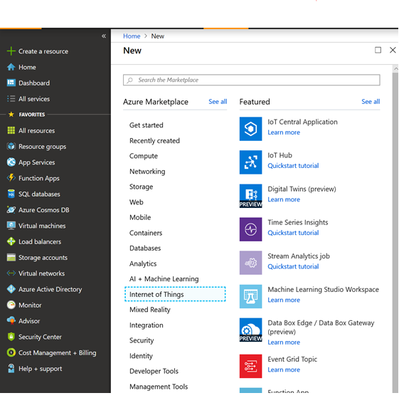

4.  Enter the following:

| **Property**       | Description                                                                                                                          |
|--------------------|--------------------------------------------------------------------------------------------------------------------------------------|
| **Subscription**   | Select the subscription to use for your IoT hub.                                                                                     |
| **Resource Group** | Select your resource group for your IoT hub                                                                                          |
| **Region**         | This is the region in which you want your hub to be located. Select the location closest to you from the dropdown list.              |
| **IoT Hub Name**   | Put in the name for your IoT Hub. This name must be globally unique. If the name you enter is available, a green check mark appears. |

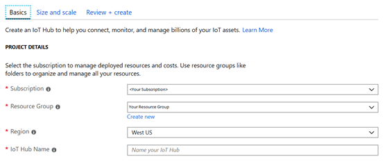

Click on “Next: Size and Scale”

5.  In the ‘size and scale’ tab, select S1 as the Pricing and scale tier, 1 as
    the total number of units and 4 default device-to-cloud partitions (**all
    default settings**)

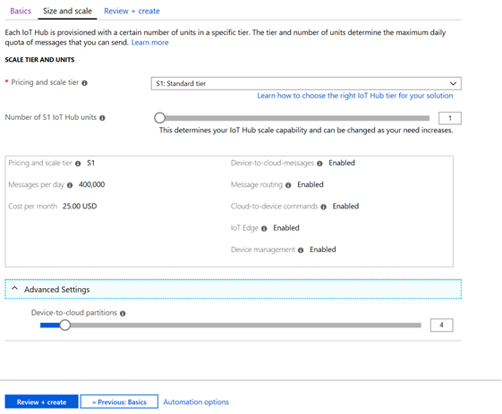

Click on “Review + Create”

6.  Review and click on “Create”

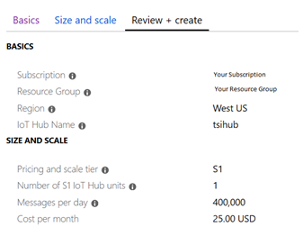

*Define a new consumer group*

TSI requires a unique consumer group for your hub. The following steps detail
how you can create a new consumer group in your hub.

1.  In your IoT hub, go to “Built-in endpoints”

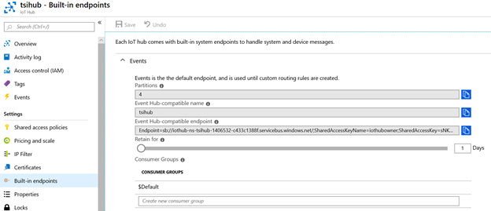

2.  Under the “Consumer Groups” section, type a unique name for your TSI
    consumer group to create one.

**Step 2: Send Events to your hub**

In this step, you will simulate 3 devices and send data to your IoT Hub

1.  In your IoT hub, go to “IoT devices” and click on “+ Add”

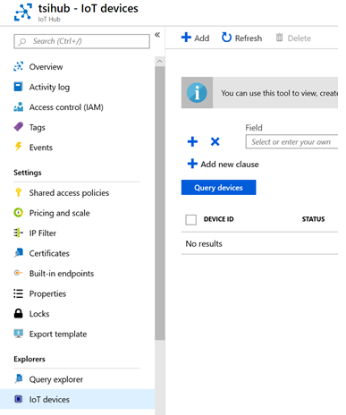

2.  Enter “device1” in the “deviceId” textbox and click save (you can leave the
    default settings enabled)

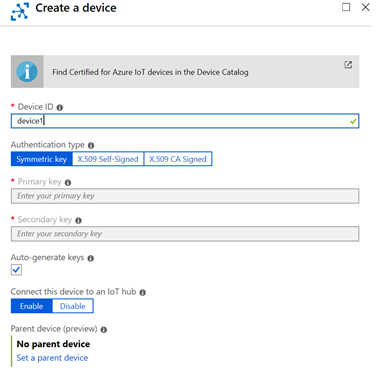

3.  You need to save the primary connection string for the device. Go to “IoT
    devices” and click on “device 1”

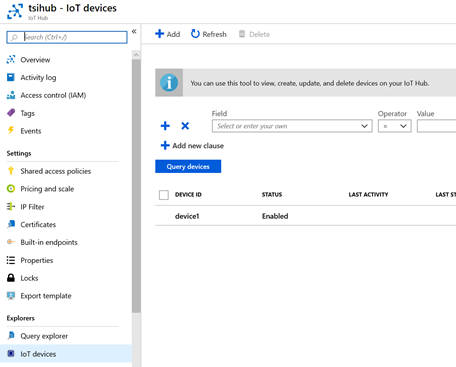

4.  Save the “Connection String (primary key)” for this device. You are going to
    use this endpoint to send events.

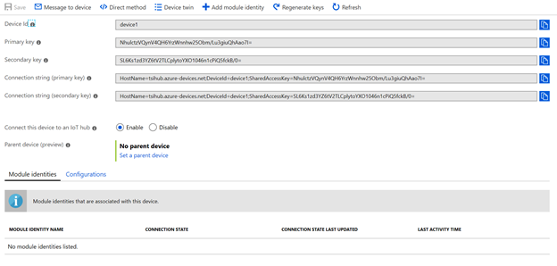

5.  Repeat the same steps (step 1 – 4) to create 2 new devices with Ids: “device
    2” and “device 3”. Save their primary connection strings as well

6.  To send events you will need a Raspberry Pi web simulator. Go to
    [https://azure-samples.github.io/raspberry-pi-web-simulator/\#GetStarted](https://azure-samples.github.io/raspberry-pi-web-simulator/)

7.  In the “coding area”, replace the placeholder text in Line 15 with the
    device1 connection string that you saved. (Step 4)

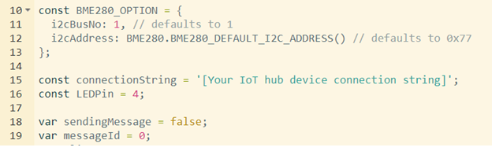

8.  Click on “Run” at the bottom right of the page to execute the code. You
    should see messages being sent to the hub.

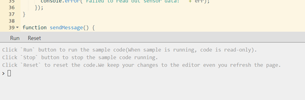

9.  You need to repeat the same steps (Steps 6-9) for “device 2” and “device 3”

>   Open 2 new tabs in your browser and go to
>   [https://azure-samples.github.io/raspberry-pi-web-simulator/\#GetStarted](https://azure-samples.github.io/raspberry-pi-web-simulator/).
>   Replace the connection string for devices: “device2” and “device 3” and
>   click on run to send events to the hub.

>   **Do not close any of the 3 browser tabs for this lab.**

**Step 3: Create a Time Series Preview Environment**

This section describes how to create a Time Series Insights update environment
using the Azure Portal.

1.  Sign into Azure Portal using your subscription account

2.  Select **+ Create a resource** in the upper left.

3.  Select the **Internet of Things** category, then select **Time Series
    Insights.**

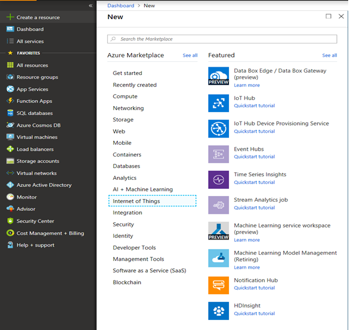

4.  On this page, you will configure your TSI environment. Fill in the fields on
    the page as follows:

| **Property**             | Description                                                                                                                                                                                                                                                    |
|--------------------------|----------------------------------------------------------------------------------------------------------------------------------------------------------------------------------------------------------------------------------------------------------------|
| **Environment name**     | Choose a unique name fo­r the Azure Time Series Insights Preview environment.                                                                                                                                                                                  |
| **Subscription**         | Enter your subscription where you want to create the Azure Time Series Insights Preview environment. It's a best practice to use the same subscription as the rest of your IoT hub.                                                                            |
| **Resource group**       | A resource group is a container for Azure resources. Choose an existing resource group, or create a new one, for the Azure Time Series Insights Preview environment resource. It's a best practice to use the same resource group as the rest of your IoT hub. |
| **Location**             | Choose a datacenter region for your Azure Time Series Insights Preview environment. To avoid added bandwidth costs and latency, it's best to keep the Azure Time Series Insights Preview environment in the same region as your IoT hub.                       |
| **Tier**                 | Select **PAYG**, which stands for pay-as-you-go. This is the SKU for the Azure Time Series Insights Preview product.                                                                                                                                           |
| **Property name**        | **Enter something that uniquely identifies your time series. Note that this field is immutable and can't be changed later. For this lab, use “iothub-connection-device-id”.**                                                                                  |
| **Storage account name** | Enter a globally unique name for a new storage account to be created.                                                                                                                                                                                          |

 Click on “Next: Event Source”. 

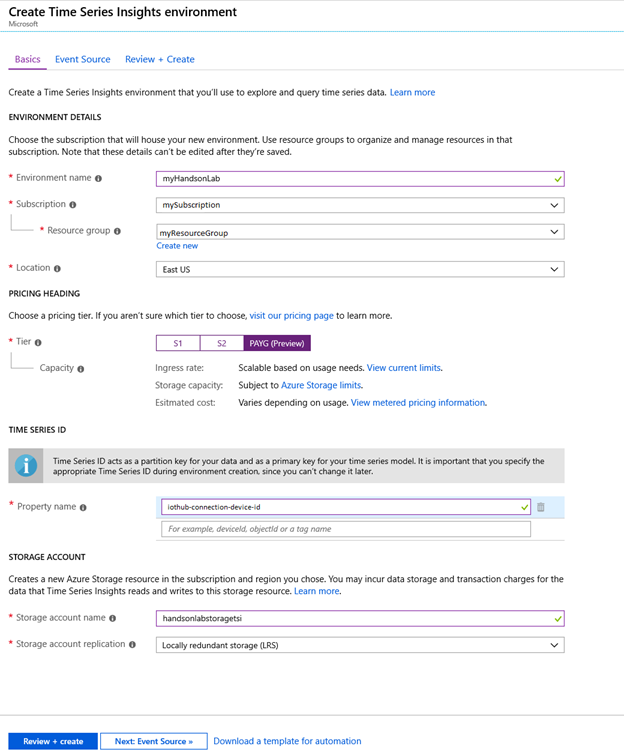

1.  On this page, you will configure your event source for TSI. Fill the
    following fields below:

| **Property**                   | Description                                                                                                                |
|--------------------------------|----------------------------------------------------------------------------------------------------------------------------|
| **Create an event source?**    | Enter **Yes**.                                                                                                             |
| **Name**                       | Enter a unique name that's used to identify the event source.                                                              |
| **Source type**                | Enter **IoT Hub**.                                                                                                         |
| **Select a hub?**              | Enter **Select existing**.                                                                                                 |
| **Subscription**               | Enter your subscription.                                                                                                   |
| **IoT hub name**               | Select your IoT hub that you created in step 1                                                                             |
| **IoT Hub Access Policy name** | Select “iothubowner”                                                                                                       |
| **IoT Hub consumer group**     | Select the consumer group that you created in step 1                                                                       |
| **Timestamp property**         | This field is used to identify the timestamp property in your incoming telemetry data. For this lab, leave the field blank |

Click on “Next: Review + Create”.

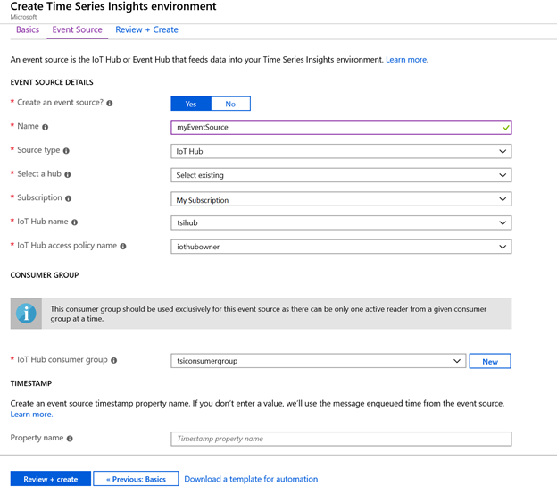

6.  Review all the details and click “Create” to start provisioning your
    environment.

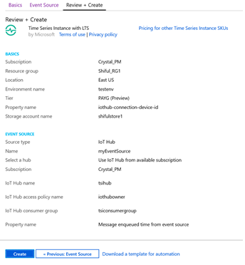

7.  You will receive a notification once the deployment has completed
    successfully.

**Step 4: Explore data in your TSI Environment**

In this section, you will perform basic analysis on your new TSI environment.

1.  Go to your Azure Time Series Insights Preview explorer by selecting the URL
    from the resource page in the [Azure portal](https://portal.azure.com/).

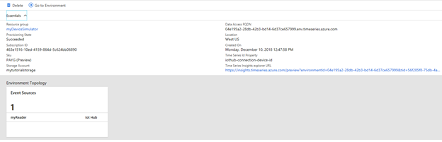

2.  Wait for the environment to load in the browser. Once it loads, on the
    left-hand pane, expand “Time Series Instances” to see all the time series in
    the environment.

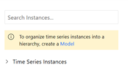

3.  Click on the first time series “device1” and then click on “Show humidity”.
    You will see a time series chart to the right. EventCount, humidity,
    messageId and temperature are the default variables created in the
    environment. Details can be found in “Step 5: Analyze data by defining a
    Model” the section below.

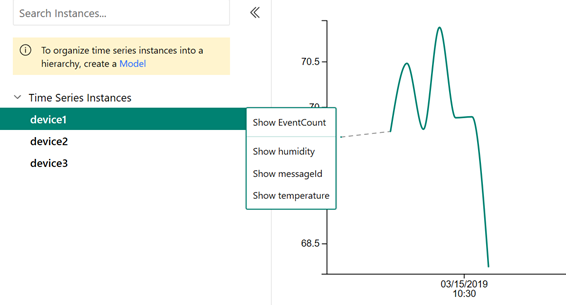

4.  Repeat the same step with “device 2” and “device 3” to compare different
    time series.

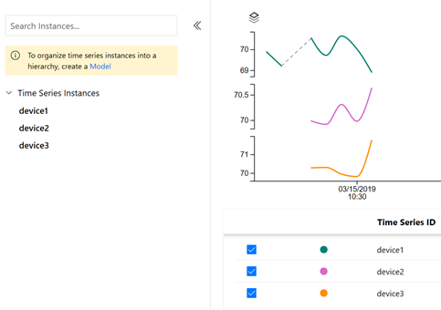

**Step 5: Contextualize and Analyze data**

In the previous section, you explored raw data without contextualization. In
this section, you will add time series model entities to contextualize your IoT
data.

Time Series Model (preview) has 3 components: Types, Hierarchies and Instances.

-   *Types* allow users to define calculations and aggregates over raw telemetry
    data and specify a tag for the sensor (example: Temperature sensor, Pressure
    sensor). In this lab you will use the ‘default type’ that performs a count
    operation.

-   *Hierarchies* allow users to specify the structure of their assets. For
    example, an organization has buildings and buildings have rooms which
    contain IoT devices. The hierarchy structure in this case will be (Building
    -\> Room).

-   *Instances* enrich incoming IoT data with device metadata. An instance links
    to 1 type definition and multiple hierarchy definitions.

1.  In the upper left part of the explorer select the Model tab:

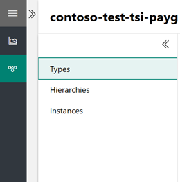

2.  For this lab we will use the default Type created by TSI.

3.  The next step is to add a hierarchy. In the Hierarchies section, select +
    Add

    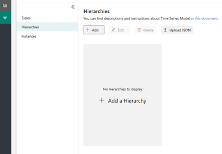

4.  A tab will open on the right-hand side. Add the following values:

| Name    | Enter **Location Hierarchy** |
|---------|------------------------------|
| Level 1 | Enter City                   |
| Level 2 | Enter Building               |
| Level 3 | Enter Floor                  |

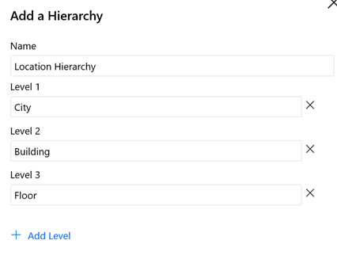

Click “Create” at the bottom

5.  You will see a hierarchy created:

    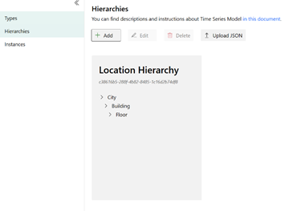

6.  Next, click on “Instances” and click on “device 1”. To edit this Instance,
    click on “Edit”

    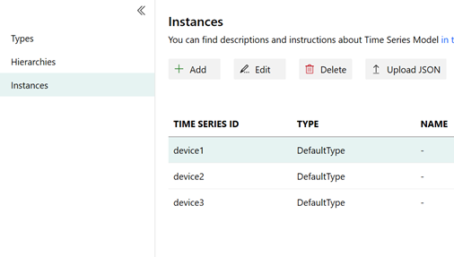

7.  On the Right-Hand Side, enter the following fields

| **Type**        | Select **Default Type**        |
|-----------------|--------------------------------|
| **Name**        | Enter **“Chiller_1”**          |
| **Description** | Enter **any description**      |
| **Hierarchies** | Enable **Location Hierarchy**. |
| **City**        | Enter **Seattle**.             |
| **Building**    | Enter **Space Needle**.        |
| **Floor**       | Enter **Floor 40**             |

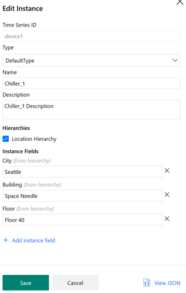

Click “Save”

8.  You will see the instances populated:

    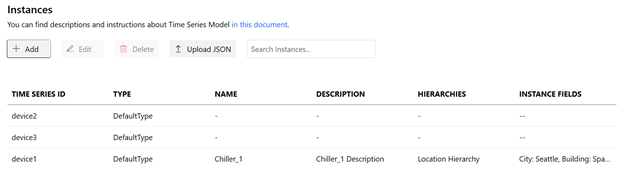

9.  Repeat step6 for device2 and device 3 with the following values:

    *Device 2:*

| **Type**        | Select **Default Type**           |
|-----------------|-----------------------------------|
| **Name**        | Enter **“Chiller_2”**             |
| **Description** | Enter **any description**         |
| **Hierarchies** | Enable **Location Hierarchy**.    |
| **City**        | Enter **Seattle**.                |
| **Building**    | Enter **Pacific Science Center**. |
| **Floor**       | Enter **Floor 20**                |

*Device 3:*

| **Type**        | Select **Default Type**         |
|-----------------|---------------------------------|
| **Name**        | Enter **“Chiller_3”**           |
| **Description** | Enter **any description**       |
| **Hierarchies** | Enable **Location Hierarchy**.  |
| **City**        | Enter **New York**.             |
| **Building**    | Enter **Empire State Building** |
| **Floor**       | Enter **Floor 30**              |

10.  Navigate back to the “Analyze tab”. You will see a hierarchy that enables
    easy navigation and that provides context to the raw sensor data .

1.  Now navigate the hierarchy by going to “New York” -\> “Empire State
    Building” -\> “Floor 30”. Click on Chiller_3 and click on “Show humidity”

    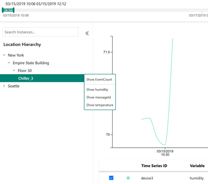

2.  To compare “Chiller_3” with “Chiller_2” humidity, add Chiller_2 humidity as
    follows:

    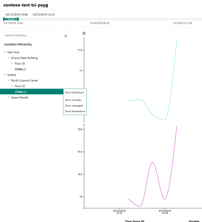

    At the end of the lab, cleanup resources that you created – IoT hub and
    TSI(preview)
